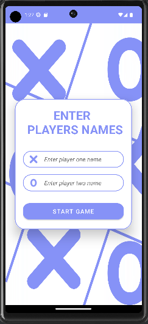
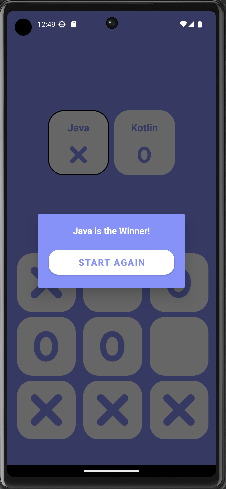
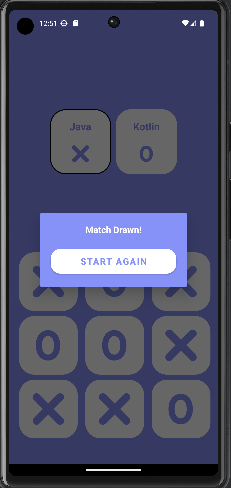

# Tic-Tac-Toe

## About 

The Tic Tac Toe app is a simple, yet addictive game that is perfect for players of all ages. As a new Android developer's first project, this app aims to showcase my skills and creativity while providing a fun and engaging experience for users.

## Snapshots from the app:

## How to use
- If you just want to install and enjoy the game, simply download `TicTacToe.apk` from the `apk` folder in the root directory. Install the game on your mobile phone and have fun!
- If you want to use this project or add to it, clone this repository and simply open the project in your Android Studio.
